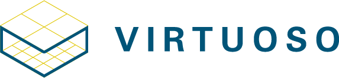

## Overview

The **VIRTUOSO SDK (VSDK)** is a Unity-based XR software
development kit that enables developers to build XR experiences with naturalistic user interactions *faster* while including support for a variety of XR devices and peripherals, from HMDs to hand tracking and haptics. VSDK is completely free and open-source under the MIT License and
is based on VRTK ([http://vrtk.io](http://vrtk.io/)).

Here are some of the features that make VSDK unique:

- Hand Tracking for interactions—VSDK supports Leap Motion, 
ManusVR, Sense Glove, and other systems so users can 
interact with virtual environments with their own hands

- Haptic Feedback—physics-based and pattern-driven haptic feedback with support for devices as simple as controllers
or as extensive as the bHaptics TactSuit.

- Rapid prototyping through the Reaction System—extensible,
event driven behavior based on naturalistic interactions

## Getting Started

VSDK has several project-focused tutorials to help get you up to speed. Tutorials can be found [on the GitHub Wiki](https://github.com/charles-river-analytics/VSDK/wiki)

## Documentation

Documentation can be found on our [GitHub Wiki](https://github.com/charles-river-analytics/VSDK/wiki)

## Supported Devices

VSDK supports a wide variety of XR devices, including:

VR Systems:
- SteamVR (HTC Vive, WindowsMR HMDs)
- Oculus (Rift and Quest)

Hand Tracking:
- Leap Motion
- ManusVR
- Sense Glove

Haptics:
- bHaptics TactSuit
- SteamVR & Oculus Controllers
- ManusVR
- Sense Glove

For a complete list of supported and planned devices, refer to our [Device Roadmap](https://github.com/charles-river-analytics/VSDK/wiki/Device-Roadmap)

## Development Roadmap
For our roadmap of upcoming devices and features, refer to our [Device Roadmap](https://github.com/charles-river-analytics/VSDK/wiki/Device-Roadmap) and [Feature Roadmap](https://github.com/charles-river-analytics/VSDK/wiki/Feature-Roadmap) respectively.

## Support

For questions or additional help, email us at virtuoso@cra.com

## Contributions

If you are interested in contributing to development or becoming involved in our development community, we’d
like to get in touch. See our [Contributing](CONTRIBUTING.md) page for more details.

## License

VSDK is release as open-source under the MIT License. Please
refer to the [License](LICENSE.md) page for more information.
